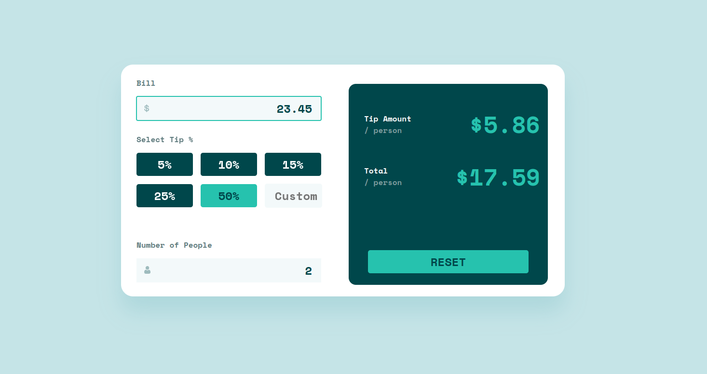

# Frontend Mentor - Tip calculator app solution

This is a solution to the [Tip calculator app challenge on Frontend Mentor](https://www.frontendmentor.io/challenges/tip-calculator-app-ugJNGbJUX). Frontend Mentor challenges help you improve your coding skills by building realistic projects.

## Table of contents

- [Overview](#overview)
  - [The challenge](#the-challenge)
  - [Screenshot](#screenshot)
  - [Links](#links)
- [My process](#my-process)
  - [Built with](#built-with)
  - [What I learned](#what-i-learned)
  - [Continued development](#continued-development)
  - [Useful resources](#useful-resources)
- [Author](#author)
- [Acknowledgments](#acknowledgments)

## Overview

### The challenge

Users should be able to:

- View the optimal layout for the app depending on their device's screen size
- See hover states for all interactive elements on the page
- Calculate the correct tip and total cost of the bill per person

### Screenshot

### Links

- Live Site URL: [Live Site](https://resilient-gelato-5621c5.netlify.app/)

## My process

### Built with

- [React](https://reactjs.org/) - JS library

### What I learned

This was a fun challenge and I learned how to use state better to have all the various compoenents work togther. Granted I didn't really use "components" in this challenge. I just dumped all the methods and functions into one component called calculator. Still have a better understading of handling events and useState after this challenge.

Used a lot of ternary operators in classess and div's that were based on the state of other componenents. I couldn't get the Number of People to outline red based on a zero input. I was going to skip over it and default to one but it made the input of a custom value a bit goofy for the end user.

### Continued development

Need to get better in setting up mobile CSS. I struggled a bit with getting everything laid out correctly for the mobile view. I'm wondering if it's my intial setup of the div's.

- Website - [Add your name here](https://www.joeirvine.com)
- Frontend Mentor - [@yourusername](https://www.frontendmentor.io/profile/TheShonuff)
- Twitter - [@yourusername](https://www.twitter.com/TheDevShonuff)
